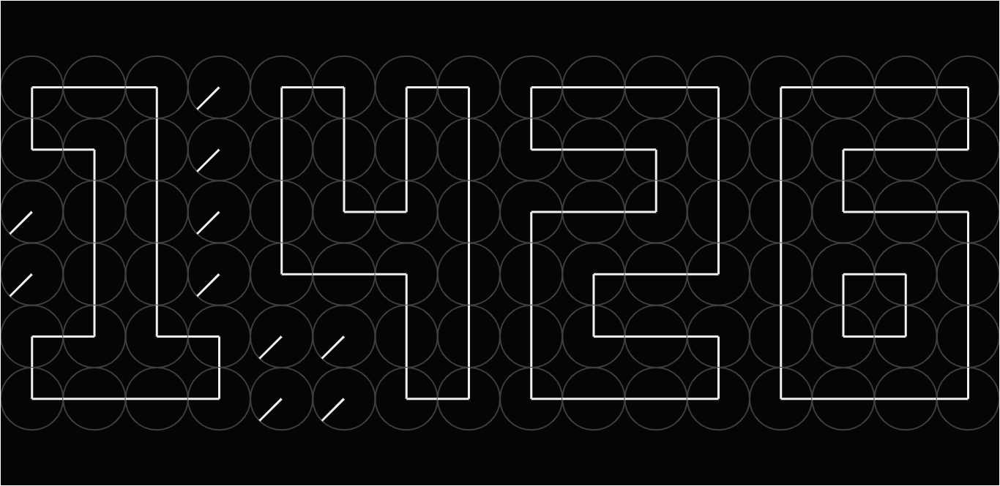
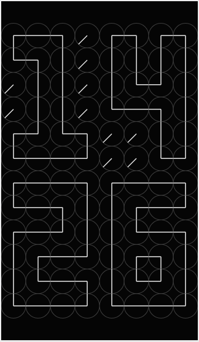

# Clock-of-Clocks
A simple flask server to generate a webpage to display the clock of clocks animation.

<h2>Requirements</h2>
<ul>
  <li>A Python distribution, such as Anaconda</li>
  <li>flask</li>
</ul>

<strong>Note</strong>: If you are only integrating the canvas object, you need only get the clock_of_clocks.js file.

<h2>About</h2>

The clock_of_clocks.js script attaches itself to the canvas object on your webpage. It can be retooled to fit your particular purpose - directly adjust the background color, clock frame color & line width, and clock hand color & line width. The javascript will also smartly adjust the clock digits to better fit the canvas dimensions. 

<h2>Basic Demo Video:</h2>

<h2>Appearance on PC:</h2>

<h2>Appearance on Mobile:</h2>

